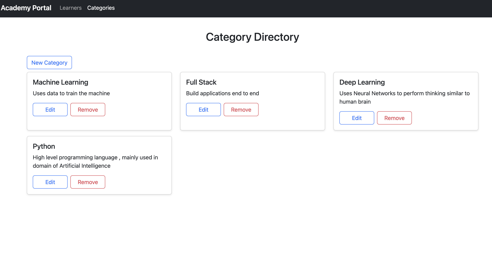
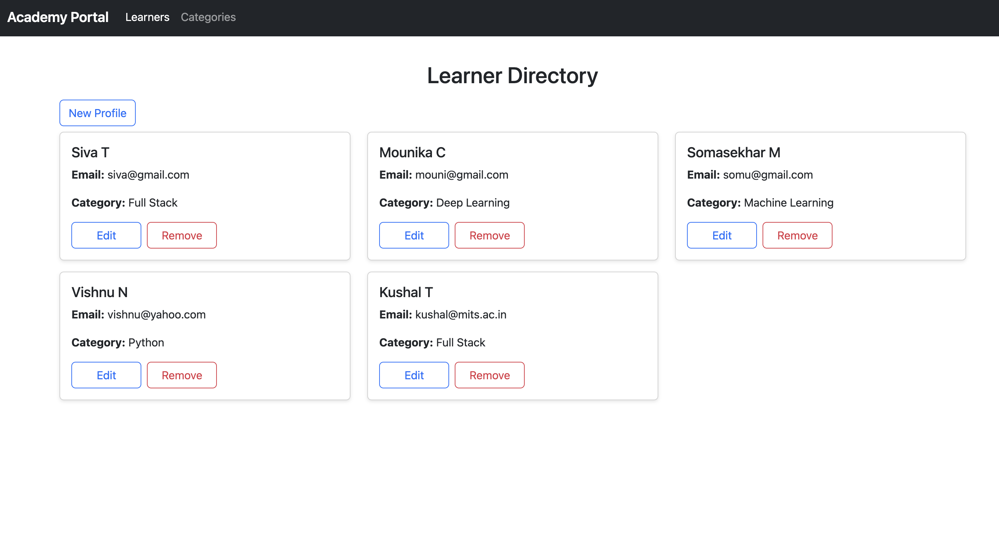
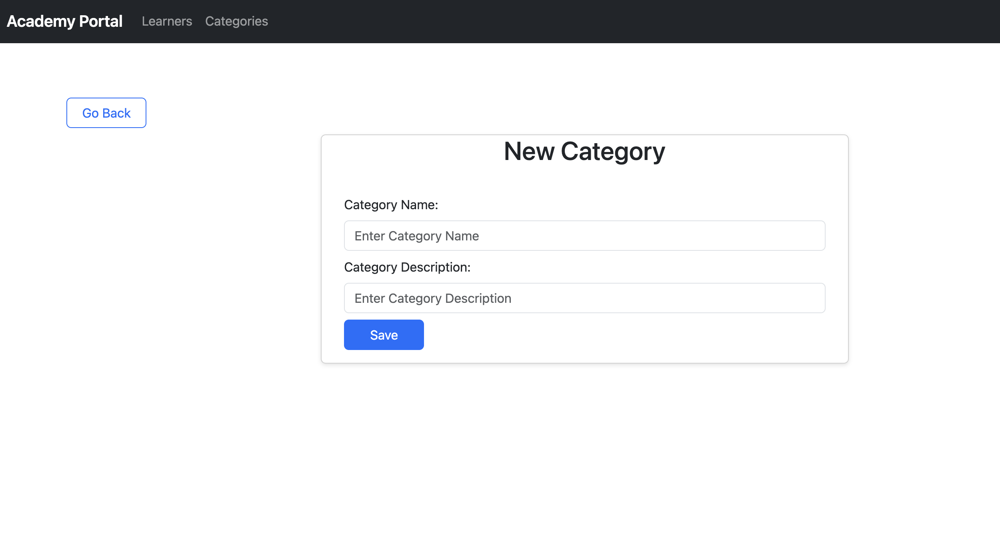
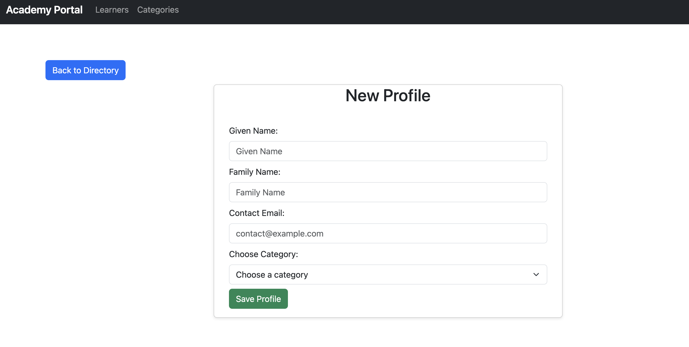
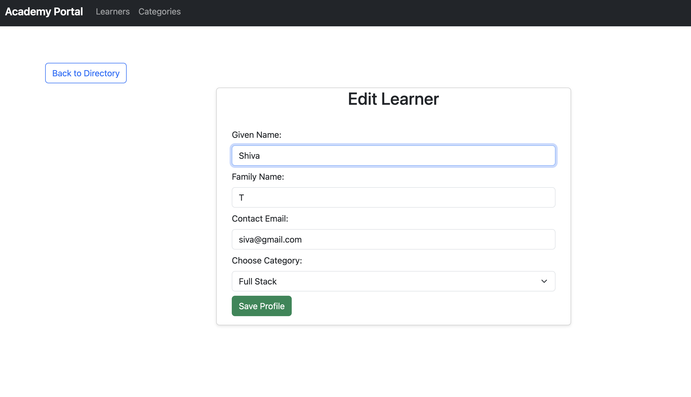
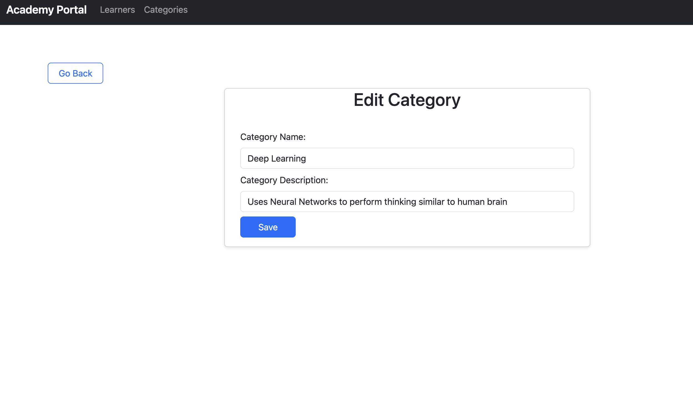

# Learner Management System (EMS) 📚

A Full-stack web application built using React and Spring Boot for managing learner records efficiently. The Learner Management System (EMS) allows users to add, update, and delete learner information, along with their respective categories. This system ensures seamless communication between the frontend and backend, providing a user-friendly interface to manage learner details.

## Tech Stack 🖥

**Client:** React, Bootstrap, React Router, Axios, Toast Notifications Library

**Server:** Spring Boot, Spring JPA, Spring Web, MySQL

## Key Features 🎇

- Add, update, and delete learner records with their first name, last name, email, and category.
- View a list of learners with category information.
- Manage categories by adding and updating their names and descriptions.
- Integration of React for the frontend, ensuring dynamic user interfaces.
- Backend powered by Spring Boot, providing RESTful APIs for data manipulation.
- Utilizes Axios for making asynchronous HTTP requests between the frontend and backend.
- Implements React Router for client-side routing, ensuring a smooth user experience.
- Toast notifications for informing users about successful and failed actions.
- Utilizes custom hooks for encapsulating and reusing logic across components.

## Screenshots 🎞
Add your screenshots to the `./assets/` folder (example names shown). Use relative paths so images display on GitHub.

## Instructions 🕶
**Prerequisites:**

Before running this application, ensure that you have the following prerequisites in place:

- Java Development Kit (JDK) 11 or above
- Node.js and npm (Node Package Manager)
- MySQL database with a designated schema named "learner_management_system"

**Set Up the MySQL Database:**

- Create a MySQL database named "learner_management_system".
- Update the database connection properties in the application.properties file located in the ems-backend folder.
- Set the accurate values for spring.datasource.url, spring.datasource.username, and spring.datasource.password.
- Build and Run the Spring Boot Backend:
- Open a terminal and navigate to the ems-backend folder.
- Build the backend application using Maven: Execute the command ./mvnw clean package.
- Run the backend application: Use the command ./mvnw spring-boot:run.
- Install Dependencies and Run the React Frontend:
- Open another terminal and go to the ems-frontend folder.
- Install dependencies using npm: Run npm install.
- Start the React development server: Execute npm run dev.
- Access the Application:
- Open your web browser and enter http://localhost:3000 to access the React frontend and interact with the application.

With these steps, you'll have the necessary environment set up to run the Spring Boot backend and the React frontend of the application locally.

